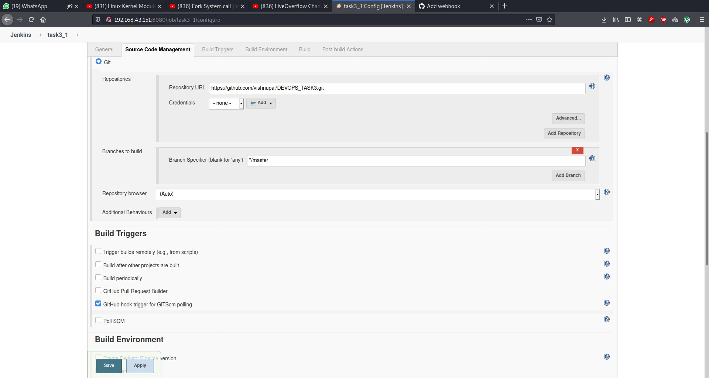
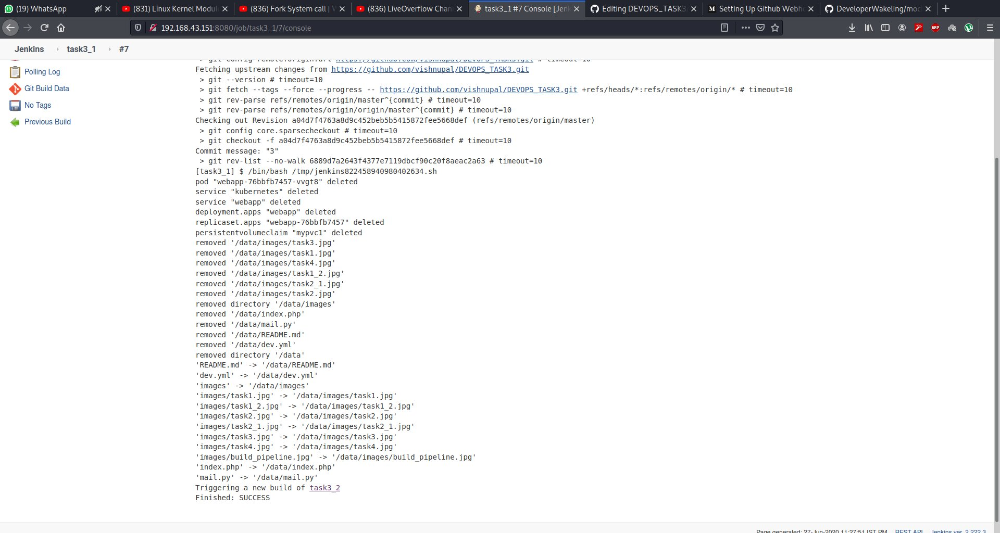
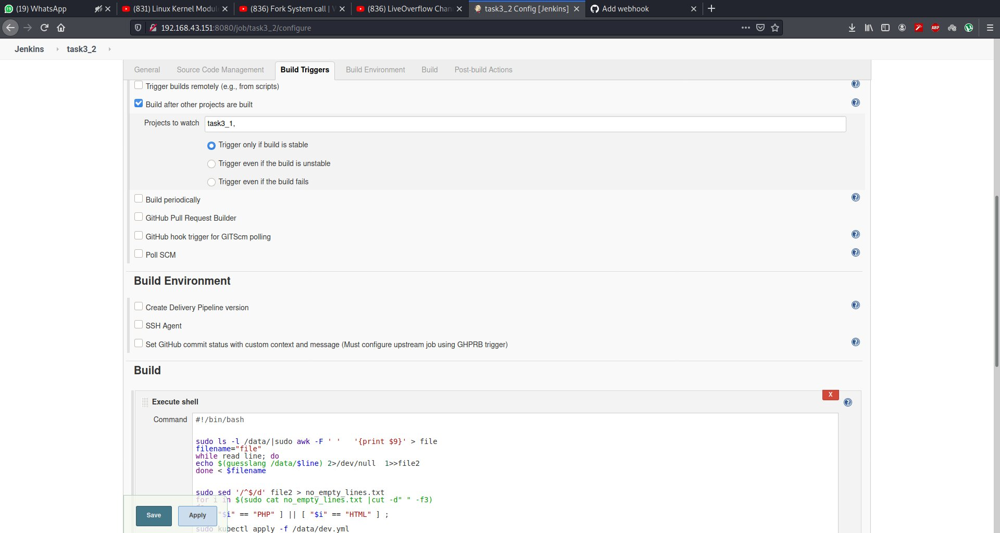
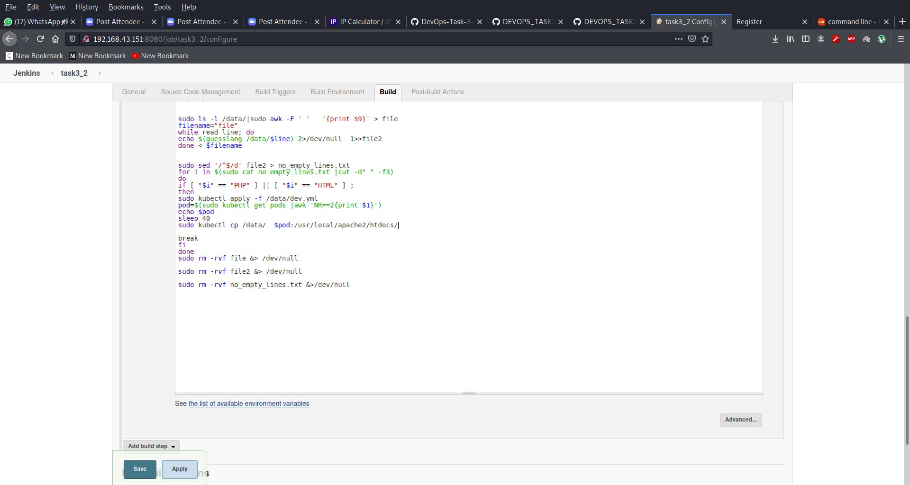
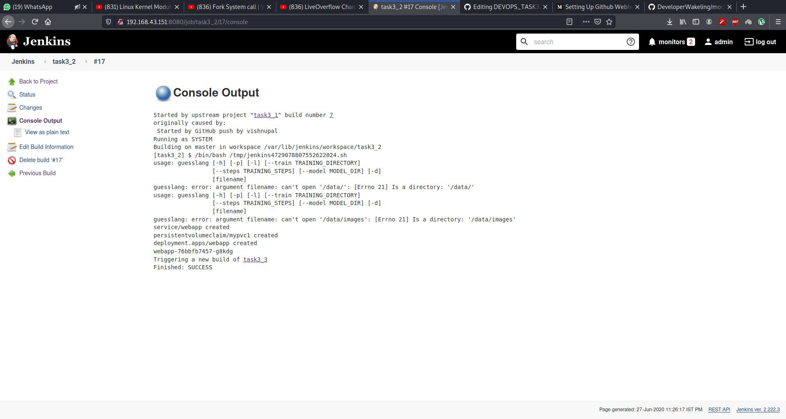
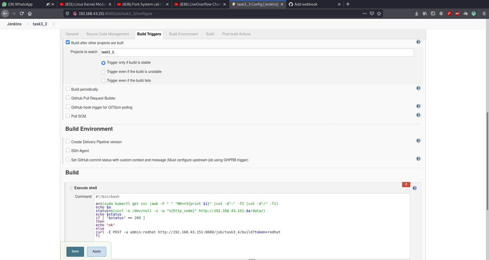
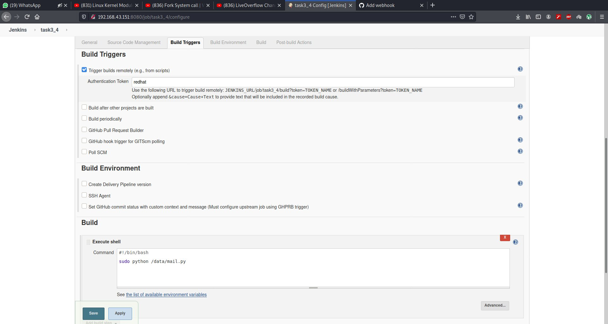
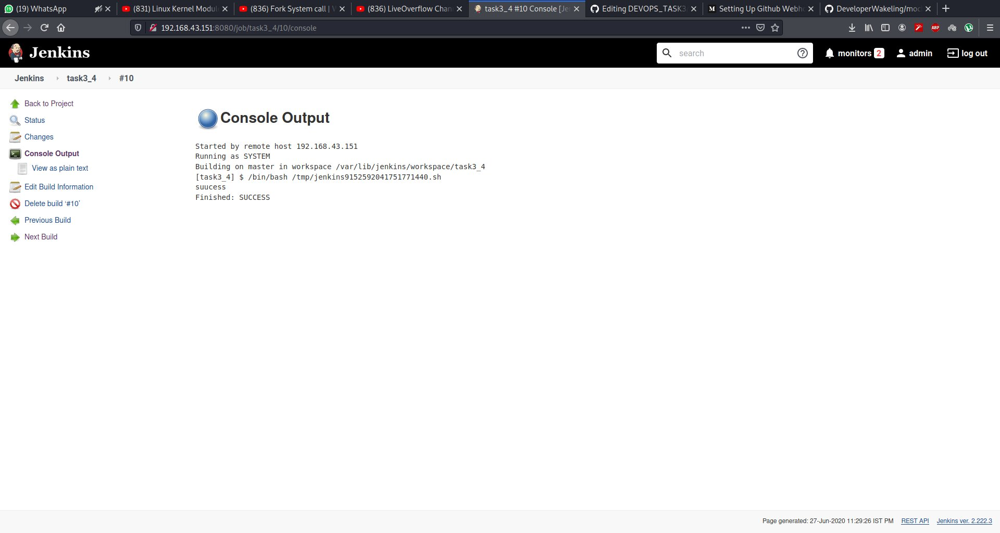
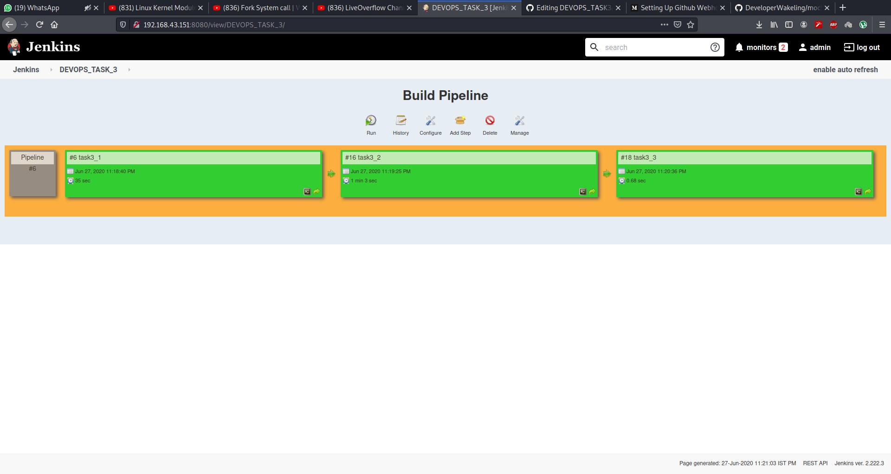

# DevOps_Task_3 Integrating with Jenkins and Kubernetes
## For perform this task we need of some tools like
### 1.Github 
### 2.Git
### 3.Jenkins
### 4.K8s
### 5.Docker

## I Perform this task on my debian based linux system so here i have already jenkins are install so  i not create any image of jenkins  and my minikube are configure with my docker engine so when i run the k8s  then it is run on my docker engine but you can use jenkins iamge and configure kubectl on top of that image to mange minikube .

## so perfoming the job1 i pull the github repo from github when webhook trigger 

