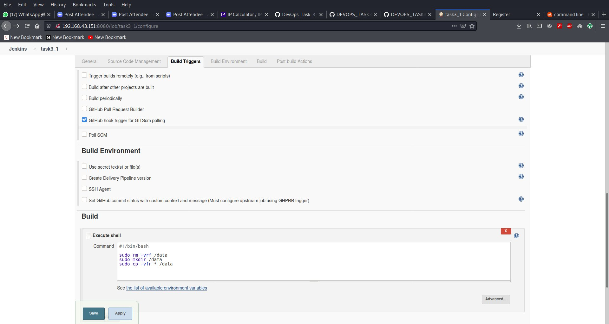
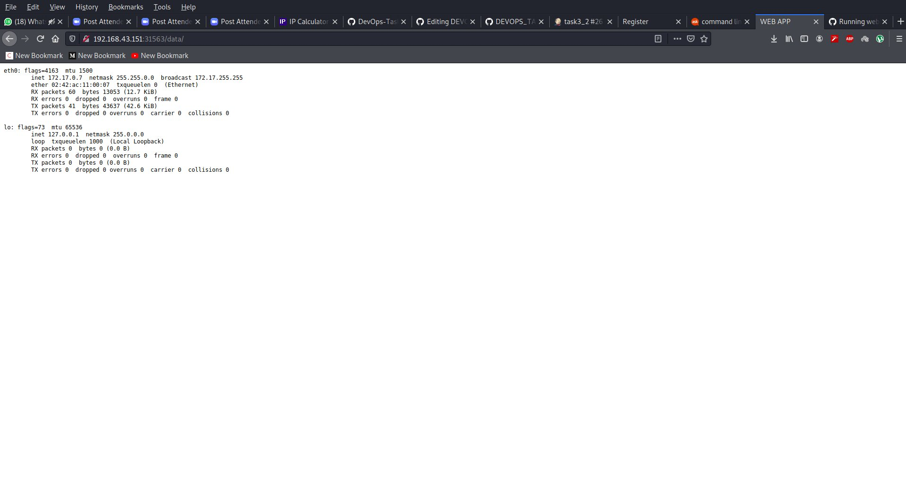
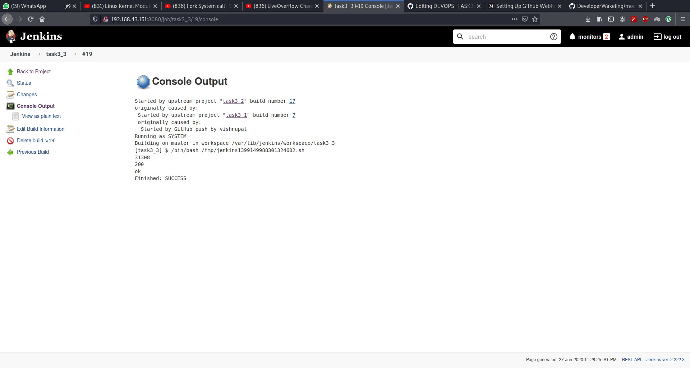

# DevOps_Task_3 Integrating with Jenkins and Kubernetes
## For perform this task we need of some tools like
### 1.Github 
### 2.Git
### 3.Jenkins
### 4.K8s
### 5.Docker

### I Perform this task on my debian based linux system so here i have already jenkins are install so  i not create any image of jenkins  and my minikube are configure with my docker engine so when i run the k8s  then it is run on my docker engine but you can use jenkins iamge and configure kubectl on top of that image to mange minikube .

### so perfoming the job1 i pull the github repo from github when webhook trigger , i copy all the data in the /data directory in this directory i copy yml file for devlopment ,code of our program .


### Here i just copy my repo data in /data diectory
 
### my job1 is successfull run 

### Job 2 trigger when our first job success fully complete . here this check our code and create image according our code for checking the code here i use python guesslang python module so this check the systext of our code guess the our code so this use some machine learing modules use behind this. here you can create a seprate directory for our code so this not effected by the other file like yml file .
### here i use dev.yml file for deployment , i separet all the file with "---" symbole other wise some service may failed
```
apiVersion: v1
kind: Service
metadata:
  name: webapp
  labels:
    app: webapp
spec:
  ports:
    - port: 80
  selector:
    app: webapp
    tier: frontend
  type: NodePort
---
apiVersion: v1
kind: PersistentVolumeClaim
metadata:
  name: mypvc1
  labels:
    app: webapp
spec:
  accessModes:
    - ReadWriteOnce
  resources:
    requests:
      storage: 2Gi
---
apiVersion: apps/v1 # for versions before 1.9.0 use apps/v1beta2
kind: Deployment
metadata:
  name: webapp
  labels:
    app: webapp
spec:
  selector:
    matchLabels:
      app: webapp
      tier: frontend
  template:
    metadata:
      labels:
        app: webapp
        tier: frontend
    spec:
      containers:
      - image: 9057508163/apache-server:v2
        name: webapp
       
        ports:
        - containerPort: 80
          name: webapp
        volumeMounts:
        - name: web-vol1
          mountPath: /var/www/html/
      volumes:
      - name: web-vol1
        persistentVolumeClaim:
          claimName: mypvc1
```

### here i use sleep 40 bcz some time running the code it required some time you can use if else condition to check running state with some command.

### job2 success fully guess the lang. according to code file systaxt here i can diside which file use for which use here i simply run hhtpd pods

```
root@vishnu:/data# kubectl get all
NAME                          READY   STATUS    RESTARTS   AGE
pod/webapp-5484bc58f9-rzrr8   1/1     Running   0          112s

NAME                 TYPE        CLUSTER-IP      EXTERNAL-IP   PORT(S)        AGE
service/kubernetes   ClusterIP   10.96.0.1       <none>        443/TCP        2m33s
service/webapp       NodePort    10.111.245.93   <none>        80:31563/TCP   112s

NAME                     READY   UP-TO-DATE   AVAILABLE   AGE
deployment.apps/webapp   1/1     1            1           112s

NAME                                DESIRED   CURRENT   READY   AGE
replicaset.apps/webapp-5484bc58f9   1         1         1       112s


```

### our job3  run after when job2 successfully run  here it just check the status code of our pod here i use httpd so here i use curl to check the web status code of so i just print ok but in case condition is false the it trigger our job4 , our job4 is send the email to our user. 


### here job4 only trigger when our site are not give the status code 200 so this send email to user 

### i run execute python file 

### here i use build pipeline plugin for visual for our running jobs

