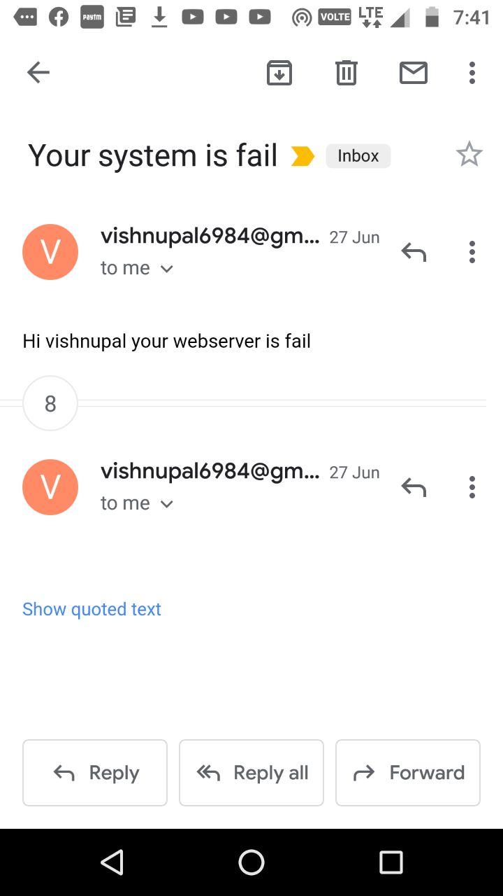

# DevOps_Task_3 Integrating with Jenkins and Kubernetes
## For perform this task we need of some tools like
### 1.Github 
### 2.Git
### 3.Jenkins
### 4.K8s
### 5.Docker

## I Perform this task on my debian based linux system so here i have already jenkins are install so  i not create any image of jenkins  and my minikube are configure with my docker engine so when i run the k8s  then it is run on my docker engine but you can use jenkins iamge and configure kubectl on top of that image to mange minikube .

## so perfoming the job1 i pull the github repo from github when webhook trigger , i copy all the data in the /data directory in this directory i copy yml file for devlopment ,code of our program .

   

## Job 2 trigger when our first job success fully complete . here this check our code and create image according our code for checking the code here i use python guesslang python module so this check the systext of our code guess the our code so this use some machine learing modules use behind this. here you can create a seprate directory for our code so this not effected by the other file like yml file .

## here i use sleep 40 bcz some time running the code it required some time you can use if else condition to check running state with some command.

## our job3  run after when job2 successfully run  here it just check the status code of our pod here i use httpd so here i use curl to check the web status code of so i just print ok but in case condition is false the it trigger our job4 , our job4 is send the email to our user. 

## here job4 only trigger when our site are not give the status code 200 so this send email to user 

### When our website fail then send mail to user for sending mail here i use python file you can use jenkins plugin also and always . here i use google to allow third party software to access my gmail other wise python code not run successfully

### here i use build pipeline plugin for visual 

